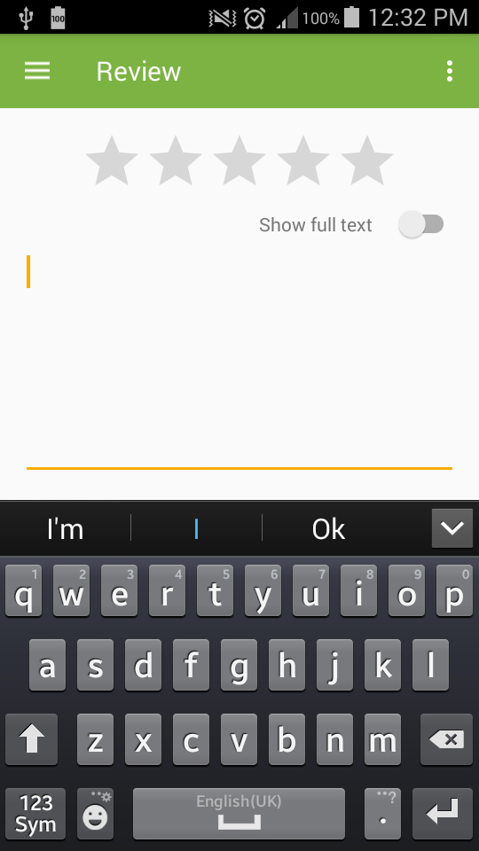

# MemverseDroid
Native Android app that interacts with the [Memverse](http://www.memverse.com) API. Requested by memverse [users](https://memverse.uservoice.com/forums/250391-general/suggestions/5858492-memverse-for-android) and [admins](https://www.memverse.com/volunteer) since 2010.

Supports Android 4.4 KitKat (API 19) and above. Designed for phone-sized screens.

## Features
### Basic Features (in approximate order of priority)
You can...
- [ ] practise example verses
- [x] list example verses
- [ ] connect to your memverse.com account
- [ ] practise and list your verses with a network connection
- [ ] rate your verse recall with a network connection
- [ ] review known verses using mnemonics (first letter of each word)
- [ ] practice and list your verses offline (synced with your memverse account)
- [ ] rate your verse recall offline (synced with your memverse account)

Once these basic features are complete I plan to release the app on the Google Play Store.

### Extra Features (in approximate order of priority)
You can...
- [ ] add memory verses
- [ ] enjoy the app on a tablet device
- [ ] see your consistency dashboard
- [ ] add memory verses directly from YouVersion
- [ ] practise passages
- [ ] complete a reference test
- [ ] complete an accuracy test
- [ ] participate in quizzes
- [ ] see your achievements dashboard
- [ ] review using speech recognition
- [ ] set up a reminder to review your verses daily

Please open an issue in the issue tracker if you'd like to request an additional feature or increase the priority of an existing feature.

## Screenshots

